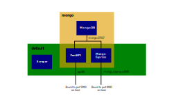

# URLStalker 

[](https://github.com/psf/black)

App to scrape URLs at regular interval

## Architecture 

* Resources: API for storing and retrieving URLs that need to be tracked, including any relevant metadata
* Snapshots: API for NoSQL DB with snapshots of URLs 
* Scraper: Go application for scraping the URLs 



## Development 

For the development, I wanted to experiment with the use of VSCode's development containers. If you have the plugin enabled in VSCode, and have Docker running on your machine, VSCode should automatically launch in the development container for the application you want to work on. Next to the development container, it also starts containers for all the other apps in the stack. 

The setup is such that if you open any of the application folders (i.e. `./resources`, `./snapshots`, or `./scraper`), it spins up a `<appname>-dev` container with all the right tooling, and mounts the working directory. Additionally, it launches (or re-uses already running) services from the stack it needs (e.g. the database). Pretty neat. 

For more reading on why development containers are promising, read [this](https://www.infoq.com/articles/devcontainers/). 

## To do

- [x] Create Snapshot app 
- [x] Create docker compose file for deployment 
- [x] Add persistent storage to snapshot app 
- [x] Add Scraper app 
- [x] Add storing functionality to scraper app 
- [x] Add delete endpoint
- [ ] Improve devcontainer workflow to allow to work on multiple parts at same time
- [ ] Add automatic test data to development PostgressDB
- [ ] Unittests (yes, I've been a bad boi)
- [X] Add Debug configurations for VSCode
- [ ] Add read end-points to snapshot app
- [ ] Add e-mail functionality  
- [ ] Add deployment pipeline 

## Techniques

This application uses the following techniques: 

- Docker and Docker compose 
- Development containers 
- Python and Go
- PostgreSQL and MongoDB 
- Alembic for SQL database migration
- SQLAlchemy ORM
- Python autoformatting using `black`, `isort` and `autoflake`
- Concurrent programming using `async` in Python, and Go-routines in Go
- FastAPI 
- Dependency management in Python with `poetry`


## New setup 

Okay, so using both a SQL database and a MongoDB is not a good setup. Instead, let's work with just a MongoDB. In the new setup, we'll have one database within a MongoDB (`urlstalker`), which has two collections: 

- `resources` - contains resources that need to be tracked, including metadata and latest snapshot
- `snapshots` - contains full list of all snapshots, including link to resource id


The resource model has the following format: 

```json
{
    "_id": 123456789,
    "url": "https://example.com", 
    "email": "john@doe.com", 
} 
```

Snapshots have the following shape: 

```json 
{
    "_id": 123456789, 
    "datetime": "2022-01-20T00:00:00.0+00:00", 
    "status_code": 200, 
    "body": "<html><body>Hello, world!<body/><html/>",
    "resource_id": 123456789
}
```